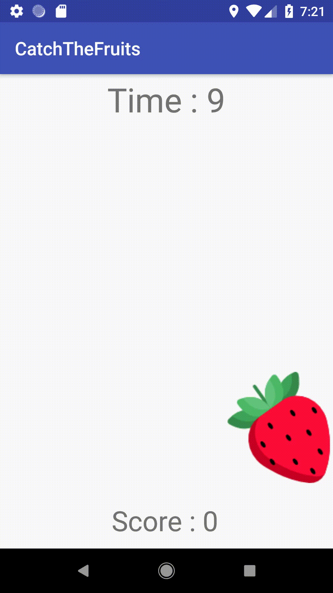
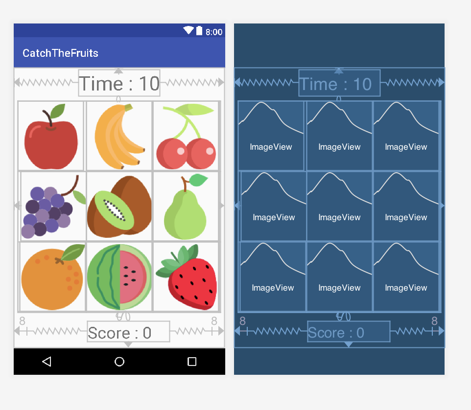

# Catch The Fruits 🍒 🍓 🍇 🍎 🍉 🍑 🍌 🥝 🍍 🫐 🍏 🍈 🍐


# What is Kotlin ⁉️

What is Kotlin? I wrote a blog post called What the Kotlin language is, what it does, its differences and similarities with Java, Kotlin's
I have added the platforms it supports and the beautiful resources. You can access the article at the link below:

https://medium.com/@halilozel1903/kotlin-nedir-43e312d2dca6


# Kotlin Tutorials 📌

I have prepared a series about Kotlin. It's a project that starts from the basics of Kotlin and moves forward.
Additions to the courses will continue. If you are new to Kotlin, I recommend you to review the examples in the link below:

https://github.com/halilozel1903/KotlinTutorials


## The goal of the project 😎

To show that Android application development with Kotlin is easier and less code than Java language.


## Gameplay of the Project 👻

There are 9 different fruit pictures in the application. 1 random one changes every half second. other 8
The fruit is hidden until the game is over. Play time is 10 seconds. How much fruit can you catch during this time?
It is an application that measures its measurement and the strength of your reflexes.

<p>
  
</p>


## Content of the Project 📖

The following structures and components were used in the project: <br>

- Data Binding
- Alert Dialog
- Timers
- Runnable & Handler
- Grid Layout
- Constraint Layout
- TextView
- ImageView


## Screen Design of the Project 📱



The project is designed as a single screen for now. The outermost Constraint Layout and the inside Grid Layout have been added. Grid Layout
9 Image Views were used in it. One text view at the top to keep the time and another to show the score below
A text view is used. You'll understand better what I'm talking about by reviewing the structure below.

https://gist.github.com/halilozel1903/fa265cdd77678d68c5d4d17efcd576aa

In order to add Grid Layout in the design section, you need to add the following statement to the gradle file.

```java 
 implementation 'androidx.gridlayout:gridlayout:1.0.0'
```

You can find the images added to Image Views by searching the following site:

https://www.flaticon.com/search?word=fruit

You can find and replace different fruits if you want. I am attaching the pictures in the project below.


<br>


<br>


## Alert Dialog Definition and Usage 🚨

We can say that Alert Dialog is a question sentence that is asked to the user after a certain operation is completed in order to make a choice.
In our project, we gave the user the number of fruits he could catch for 10 seconds.
We are used to ask if he wants to play the game again.

Below are the codes related to the definition and usage of Alert Dialog:

```kotlin 
  val dialog = AlertDialog.Builder(this@MainActivity)
                dialog.setCancelable(false)
                dialog.setTitle("Catch The Fruits")
                dialog.setMessage("Score : $score\nWould you like play again?")
                dialog.setPositiveButton("YES") { dialog, id ->
                
                   Restart()
                }
                        .setNegativeButton("NO ") { dialog, which ->
                            score = 0
                            tvScore.setText("Score : $score")
                            tvTime.setText("Time : " + "0")

                            for (image in imageArray) {

                                image.visibility = View.INVISIBLE 
                            }
                        }

                val alert = dialog.create()
                alert.show() 
```

## Using Runnable, Handler and Timer ⏱

**Runnable** : The operations to be done within the run method are specified.

**Handler & Timer** : It allows us to direct the events that we want to be repeated at certain intervals and to use them.
structures that enable us to manage.

In our project, counting backwards from 10 to 0 is performed. Therefore, the above structures were used.

```kotlin 
    var handler: Handler = Handler()

    var runnable: Runnable = Runnable { }
```
Object definitions are made.

```kotlin 
        object : CountDownTimer(10000, 1000) {

            override fun onFinish() { 

                tvTime.text = "Time's up!" 
                handler.removeCallbacks(runnable)


                for (image in imageArray) { 

                    image.visibility = View.INVISIBLE 
                }
          
            }

            override fun onTick(p0: Long) { 

                tvTime.text = "Time : " + p0 / 1000 
            }

        }.start()
```

There is a class that counts backwards from 10. If the class has 2, the method should be added.
These are the following methods. If these methods are not added, it will warn you and ask you to add the methods.

  - _onFinish_ : This method is a function that includes what to do after the operation about the Timer is completed.
In our example, when the time is up, we print a message to the text and make the visible fruits on the screen invisible.
so that he does not click on the fruits and increase the score. By deleting future calls, we finish our game.

  - _onTick_ : It is the method that specifies what will be done in each second. Update seconds every second
process is done and written in the text part.


## How to Hide Pictures and Randomly Show them 🖼

Generate 9 random numbers with the help of the Random class and use them in the function below.
we show a random image every half second. It has a structure that repeats these processes continuously.
We do it with the help of runnable and handler.

```kotlin
// method to hide pictures
fun hideImages() {
    runnable = Runnable {
        for (image in imageArray) {

            image.visibility = View.INVISIBLE
        }

        val random = Random()
        val index = random.nextInt(8 - 0)
        imageArray[index].visibility = View.VISIBLE

        handler.postDelayed(runnable, 500)
    }
    handler.post(runnable)
}
```


## Score Increase Process when Clicking on Pictures 📸

The user gets points by clicking the pictures on the screen. How does the user do this?
If you're curious, let's examine the method below ;)

```kotlin
// Function that increases points when clicking pictures

fun increaseScore(view: View) {

    score++

    tvScore.text = "Score : $score" // score value is displayed on the screen.

}
```

Each time the user clicks, the score variable is incremented once and updates the score value on the screen.

## Donation 💸

If this project help 💁 you to develop, you can give me a cup of coffee. ☕

[](https://www.buymeacoffee.com/halilozel1903)

## License  ℹ️
```
MIT License

Copyright (c) 2023 Halil OZEL

Permission is hereby granted, free of charge, to any person obtaining a copy
of this software and associated documentation files (the "Software"), to deal
in the Software without restriction, including without limitation the rights
to use, copy, modify, merge, publish, distribute, sublicense, and/or sell
copies of the Software, and to permit persons to whom the Software is
furnished to do so, subject to the following conditions:

The above copyright notice and this permission notice shall be included in all
copies or substantial portions of the Software.

THE SOFTWARE IS PROVIDED "AS IS", WITHOUT WARRANTY OF ANY KIND, EXPRESS OR
IMPLIED, INCLUDING BUT NOT LIMITED TO THE WARRANTIES OF MERCHANTABILITY,
FITNESS FOR A PARTICULAR PURPOSE AND NONINFRINGEMENT. IN NO EVENT SHALL THE
AUTHORS OR COPYRIGHT HOLDERS BE LIABLE FOR ANY CLAIM, DAMAGES OR OTHER
LIABILITY, WHETHER IN AN ACTION OF CONTRACT, TORT OR OTHERWISE, ARISING FROM,
OUT OF OR IN CONNECTION WITH THE SOFTWARE OR THE USE OR OTHER DEALINGS IN THE
SOFTWARE.
```

